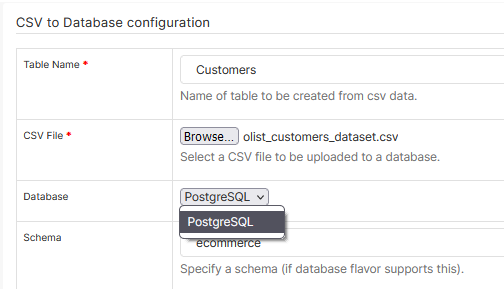
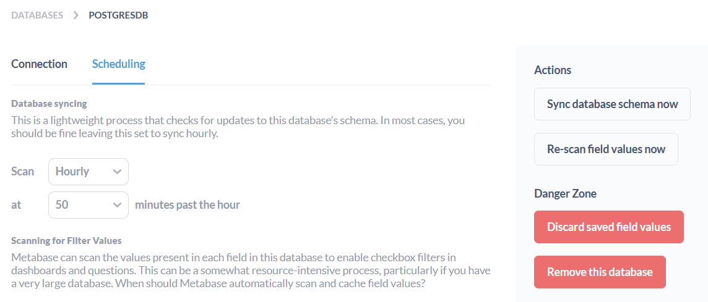
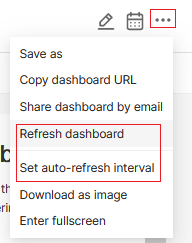
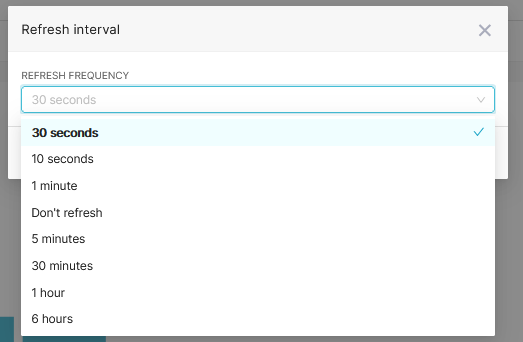
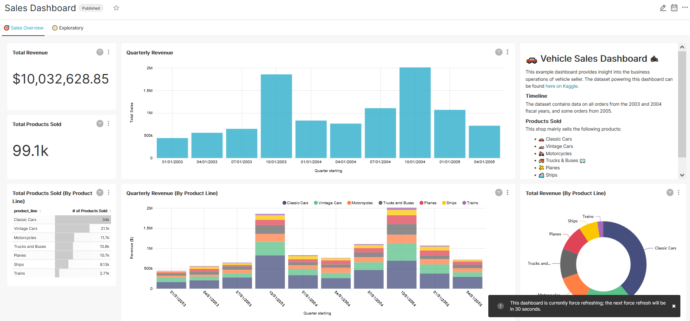
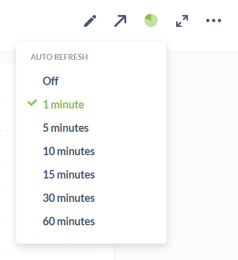

# Superset and Metabase Evaluations

Useful analysis of [Apache Superset at Dropbox](https://dropbox.tech/application/why-we-chose-apache-superset-as-our-data-exploration-platform).

## Supersetup

**With Python virtual environment** from scratch: [Installing from scratch](https://superset.apache.org/docs/installation/installing-superset-from-scratch)

**With Docker**: Recommended to run on Linux OS with Docker and `docker-compose`.

1. Clone the Apache Superset repo on GitHub

        git clone https://github.com/apache/superset.git; cd superset

2. (optional) If you have data and SQL scripts for loading data, change the `db`
   component in the `docker-compose-non-dev.yml` file to the following:

        db:
            env_file: docker/.env-non-dev
            image: postgres:latest
            container_name: superset_db
            restart: unless-stopped
            volumes:
              - db_home:/var/lib/postgresql/data
              - ../source-data:/source-data
              - ../database-setup/sourcedb.sql:/docker-entrypoint-initdb.d/sourcedb.sql
            ports:
              - "5433:5432" 

    The default settings also has no port mapping for the database, which prevents
    external connections to the database (e.g. from a VSCode extension). Specify the
    port mapping as above to make external connections possible. Other environment
    variables are in the `.env-non-dev` file.

    Modify the `docker/.env-non-dev` file not to load examples because it takes
    way too long to load them.

        SUPERSET_LOAD_EXAMPLES=no

3. Run this production version of the `docker-compose` file

        docker-compose -f docker-compose-non-dev.yml up -d

    **NOTE:** Although the official instructions at this stage say that you can
    login with username and password `admin` at `localhost:8088`, I could not. This was a
    [past issue](https://github.com/apache/superset/issues/10149) as well.

4. To fix this, go inside the `superset_app` container and run the `docker-init.sh` Bash script:

        docker exec -it superset_app bash
        cd /app/docker
        bash docker-init.sh

    This will create the Superset Admin user, with username and password `admin`.
    If `SUPERSET_LOAD_EXAMPLES` is set to `no`, running the Bash script will not
    load them. Otherwise, it will take ~30 min to load the examples.

    Another way of fixing this is to directly run the Bash script without going inside the container:

        docker exec -i superset_app bash /app/docker/docker-init.sh

5. Exit the container and go to `localhost:8088` and login with username and password
   `admin`.

Connect to database with URI string:

    postgresql+psycopg2://superset:superset@db:5432/superset

## Metabase Setup

Also recommended to run on Linux OS, facing some problems in Windows.

[One-liner](https://www.metabase.com/start/oss/) for Docker (not recommended):

    docker run -d -p 3000:3000 --name metabase metabase/metabase

[Custom setup](https://www.metabase.com/docs/latest/operations-guide/running-metabase-on-docker.html) (modified)
with a `docker-compose` file, including database container and secret files:

    docker-compose up -d

Connect to database from Metabase setup page with `hostname:port` = `postgres-metabase:5432`.
Connect from external applications using `localhost:5434`.

**NOTE:** Docker secrets don't work with `docker-compose`, they only work with Docker Swarm.
Use an environment file `.env` instead.

If containers keep exiting unexpectedly (usually when database connection credentials are invalid),
check their logs with

    docker logs [CONTAINER_NAME | CONTAINER_ID]

## CSV, Excel, and Columnar File Uploads

### Superset

CSV, Excel, and Parquet files can be uploaded but they require a SQL database to hold the data.




Otherwise, there will be an error saying that there is no database allowing you to upload your CSV:

    ERROR: No database is allowed for your csv upload

To fix this, go to `Data -> Databases`, click on `Edit` under the `Actions` column,
go to `Advanced -> Security` and check the `Allow data upload` option.


")

This uploads the CSV file as a physical table into the SQL database, but the column data types
are automatically inferred by Pandas (e.g. zip codes, which should be treated as `CHAR(5)` become `INT`), which
is undesirable in most cases. However, data types are preserved when uploading Parquet files.

For Excel files, there is an option to choose which sheet to upload.

### Metabase

Metabase doesn't have a native way to import CSV files. Instead, the CSV has to be uploaded to a database
and then Metabase can connect to that database. Direct imports from Excel and Parquet files are also not
supported.

Metabase is mainly for asking questions about data that is already in databases, and it
is expected for the user to bring their own database to connect to.

When adding a new database table, the table doesn't appear immediately unless the database schema is
synced:



The sync can be scheduled hourly or daily.

## Report Scheduling, Logging, and Dashboard Refresh

### Superset

[Alerts and scheduled reports](https://superset.apache.org/docs/installation/alerts-reports) are possible, with
some setup. They are disabled by default.

Logs are recorded in `Settings > Security > Action Logs`.

Dashboards can be manually refreshed or refresh intervals can be set.





I tested this refresh by deleting rows from a table, waiting for the dashboard to refresh, and checking
if the dashboard is updated afterwards. Then I reinserted the rows, waited for dashboard refresh, and
verified that the dashboard goes back to its original numbers/visualizations.


SQL query to delete rows from the `cleaned_sales_data` table and hence, alter the dashboard:

```sql
-- create duplicate of vehicle sales data
CREATE TABLE cleaned_sales_data_dup AS
SELECT
  *
FROM
  cleaned_sales_data;
  
-- delete rows where sales > 3000 (this will delete 1541 rows)
DELETE FROM
  cleaned_sales_data
WHERE
  sales > 3000;

-- check that the `Sales Dashboard` refreshes with new data
```


Reinsert the rows back into the table:

```sql
-- insert back the deleted rows and check that the dashboard goes back to original
INSERT INTO
  cleaned_sales_data
SELECT
  *
FROM
  cleaned_sales_data_dup
WHERE
  sales > 3000;
```



The SQL queries above are not allowed in the SQL Lab > SQL Editor page, unless the `Allow DML` option is ticked
for that particular database.

### Metabase

[Pulses](https://www.metabase.com/docs/v0.40/users-guide/10-pulses.html), soon to be deprecated
in favor of [Dashboard subscriptions](https://www.metabase.com/docs/v0.40/users-guide/dashboard-subscriptions.html) 
can be set up to send Slack alerts and scheduled reports to emails, after setting up a Sender Email.
Unlike Superset, Metabase provides a UI to set up this Sender Email for sending scheduled reports.

Logs are recorded in `Settings > Admin > Troubleshooting > Logs`. A bit verbose though.
These logs can also be viewed through `docker logs [CONTAINER_NAME]`.

Like Superset, Metabase dashboards also support refresh intervals, and I tested this in a similar way as well.



## Drilldowns, Custom Visualizations, and Sharing

### Superset

Superset does not support drilldowns but they can be introduced via custom JavaScript code.
There is currently a [draft pull request](https://github.com/apache/superset/pull/14688) in progress for
adding drilldown functionality to Superset.

[Custom plugins for visualizations](https://superset.apache.org/docs/installation/building-custom-viz-plugins)
can be built using the React framework.

Dashboards and charts can be shared via [email or URLs](https://docs.preset.io/docs/how-to-share). Public access
to dashboards can be granted by providing `datasource access` permission to the `Public` role. For example, for
the Sales Dashboard, the `Public` user must have `datasource access on [examples].[clean_sales_data]` in order
for them to view the dashboard.

Superset can also be hosted on the cloud, which I tried out [here](https://superset-hdash.herokuapp.com/), with
the help of this [article](https://chizurumolorondu.medium.com/setting-up-apache-superset-on-heroku-b547302f600e)
and this [repo](https://github.com/zi-nt/superset-on-heroku). The functionality is limited, since the Python installation
of Superset doesn't allow uploads via Excel or Parquet, and the attached Postgres database on Heroku only allows
10,000 rows max. A better option would be to host it on a cloud vendor web hosting service, or a container registry.

### Metabase

Drilldowns are supported in Metabase and [interactive dashboards](https://www.metabase.com/docs/latest/users-guide/interactive-dashboards.html)
with customized drilldowns can also be created.

Adding custom visualizations are [much harder to do in Metabase](https://github.com/metabase/metabase/issues/13889)
and it does not have a custom plugin architecture like Superset.

Dashboards can be [shared with public links](https://www.metabase.com/docs/latest/users-guide/07-dashboards.html#sharing-dashboards-with-public-links),
and can be embedded into websites as well. Sender Email has to be set up first, and if using `TLS` encryption, choose
`STARTTLS` instead. `Public Sharing` in `Settings > Admin > Public Sharing` has to be enabled as well.
